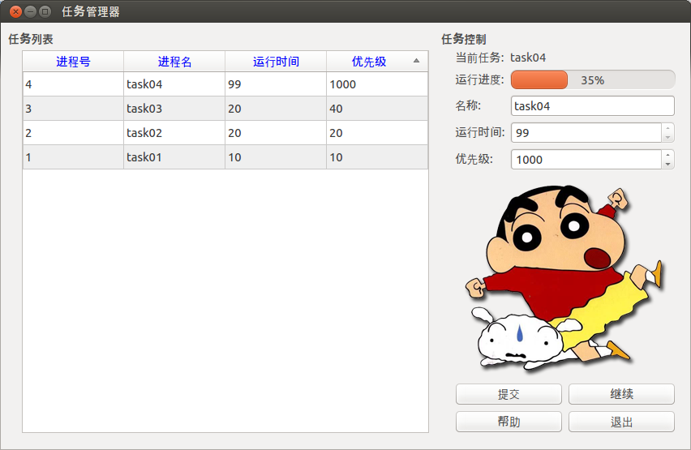
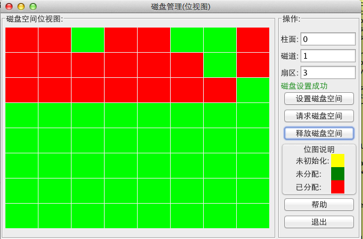
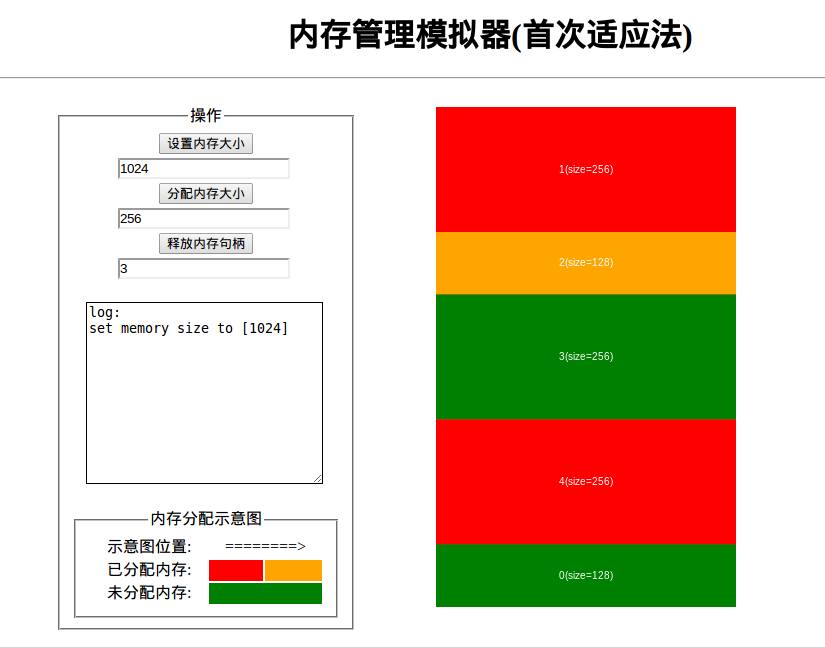

#Campus Stuff

##Description

这里主要放一些大学期间自己制作的小工具和一些作业代码

##Table of Contents

* * *

###Operation System:
####[Task Manager](#task-manager)
####[Disk Manager (in Java)](#disk-manager-java)
####[Disk Manager (in c++)](#disk-manager-cpp)
####[Memory Manager](#memory-manager)
###Encryption:
####[DES Implementation](#des)
###Software-Engineering
####[MAP](#software-engineer-map)
###Tools:
####[Router Helper](#router-helper)
####[QSname](#qsnake)
####[AMOXP](#AMOXP)
####[Git-tutor](#git-tutor)
####[land](#land)
####[lmp](#lmp)
####[Simple-Proxy](#simple-proxy)
####[student-manager](#student-manager)

* * *

##Operation System

###[Task Manager](id:task-manager)

###[[Disk Manager(in java)](./operation-system/disk-manager-java/diskmanager.md)](id:disk-manager-java)

###[Disk Manager(in c++)](id:disk-manager-cpp)

###[Memory Manager](id:memory-manager)

##Encryption

###[DES Alogorithm Implementation](id:des)

##[RouterHelper](id:router-helper)

A simple python program to control routers like speed limit and etc.

##[AMOXP](id:AMOXP)

Advanced Mac OS X Programming Source Code

##[QSnake](id:qsnake)

The traditional snake game based on Qt™

##[Git-tutorial](id:git-tutor)

Brief Tutor for Git Tool Tutor

##[Simple-Proxy](id:simple-proxy)

A simple proxy program contains both client and server

##[Software-Engineer-MAP](id:software-enginerr-map)

Software engineer course works

##[student-manager](id:student-manager)

simple student info manager system implemented in ANSI-C

##[land](id:land)

land code for WHU OJ

##[lmp](id:lmp)

Learn Mysql™ & PHP™ source code
